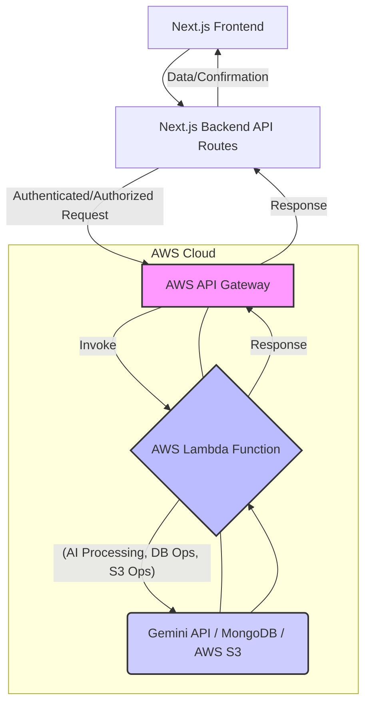

# Cognivia: An AI-Enhanced Learning & Teaching Platform

## Table of Contents

1.  [Overview](https://www.google.com/search?q=%231-overview)
2.  [Project Vision & Problem Solved](https://www.google.com/search?q=%232-project-vision--problem-solved)
3.  [Key Features & Benefits](https://www.google.com/search?q=%233-key-features--benefits)
4.  [Architectural Deep Dive: Pre-Hackathon vs. Hackathon Evolution](https://www.google.com/search?q=%234-architectural-deep-dive-pre-hackathon-vs-hackathon-evolution)
      * [Pre-Hackathon Architecture (Team Contribution)](https://www.google.com/search?q=%23pre-hackathon-architecture-team-contribution)
      * [Hackathon Architectural Enhancements (Solo Work)](https://www.google.com/search?q=%23hackathon-architectural-enhancements-solo-work)
      * [AWS Lambda Integration: A Detailed Flow](https://www.google.com/search?q=%23aws-lambda-integration-a-detailed-flow)
      * [Benefits of AWS Lambda & API Gateway Migration](https://www.google.com/search?q=%23benefits-of-aws-lambda--api-gateway-migration)
5.  [Technology Stack](https://www.google.com/search?q=%235-technology-stack)
6.  [Prerequisites & Dependencies](https://www.google.com/search?q=%236-prerequisites--dependencies)
7.  [Installation & Setup Instructions](https://www.google.com/search?q=%237-installation--setup-instructions)
8.  [Usage Examples & API Documentation](https://www.google.com/search?q=%238-usage-examples--api-documentation)
9.  [Configuration Options](https://www.google.com/search?q=%239-configuration-options)
10. [Contributing Guidelines](https://www.google.com/search?q=%2310-contributing-guidelines)
11. [License Information](https://www.google.com/search?q=%2311-license-information)
12. [Acknowledgments](https://www.google.com/search?q=%2312-acknowledgments)

-----

## 1\. Overview

Cognivia is a sophisticated, AI-powered web application meticulously crafted to revolutionize the educational landscape for both students and instructors. Built on the robust Next.js framework with React and TypeScript, this platform integrates advanced features like intelligent quiz generation, comprehensive assignment management, and personalized AI-driven learning tools. This project initially emerged as a collaborative academic endeavor and has since been significantly enhanced and optimized for scalability and performance during the AWS Lambda Hackathon.

## 2\. Project Vision & Problem Solved

The core vision behind Cognivia is to bridge the gap between traditional learning methodologies and the burgeoning capabilities of artificial intelligence. We aim to create an intuitive, adaptive, and efficient educational ecosystem that empowers educators to manage their classes effortlessly and provides students with highly personalized learning experiences.

**Key Problems Addressed:**

  * **Inefficient Content Creation:** Teachers spend significant time generating quizzes and notes. Cognivia automates this using AI.
  * **Lack of Personalization:** Generic learning materials often fail to cater to individual student needs. Our AI tailors content dynamically.
  * **Fragmented Educational Tools:** Disparate tools for class management, assignments, and communication lead to inefficiencies. Cognivia offers an integrated solution.
  * **Scalability Challenges:** Traditional monolithic architectures can struggle under heavy user loads, particularly for compute-intensive tasks like AI inference. Our re-architecture addresses this by leveraging serverless computing.

## 3\. Key Features & Benefits

Cognivia offers a rich set of features designed to enhance the teaching and learning experience:

  * **Secure User Authentication:**
      * Robust user lifecycle management: login, signup, forgot/reset password, email verification, and account unblocking.
      * Role-based access control with distinct dashboards for administrators and teachers.
  * **AI-Powered Learning & Content Generation:**
      * **AI Quiz Generation:** Dynamically generate quizzes on any topic, providing immediate, personalized assessments.
      * **AI Notes Generation:** Create detailed, concise notes from provided content or topics, aiding comprehension and study.
      * **Cognivia Chatbot:** An intelligent AI assistant available 24/7 for student queries, explanations, and concept clarification (powered by Gemini API).
  * **Comprehensive Assignment Management:**
      * Teachers can create, publish, and manage assignments with ease.
      * Students can submit assignments, with support for file uploads (stored securely on AWS S3).
  * **Dynamic Quiz Management:**
      * Generate and deploy quizzes based on curriculum.
      * Track and analyze quiz results for performance insights.
      * Secure storage of quiz data.
  * **Class & Student Management (Teacher Dashboard):**
      * Create and manage multiple classes.
      * Enroll and manage students within specific classes.
      * Schedule and manage live class sessions.
  * **Student Profile Management:**
      * Students can view and update their personal profiles, track their progress, and review past activities.
  * **User Experience Enhancements:**
      * **Dark Mode Toggle:** Provides a comfortable viewing experience in different lighting conditions.
      * **Session Logging:** Records user activities for audit trails, analytics, and debugging.
  * **Scalability & Reliability:**
      * Leverages serverless architecture (AWS Lambda, API Gateway) for highly scalable and cost-efficient execution of compute-intensive tasks, ensuring smooth performance even under peak loads.

## 4\. Architectural Deep Dive: Pre-Hackathon vs. Hackathon Evolution

Cognivia's architecture has undergone a significant transformation, evolving from a standard Next.js monolithic approach to a hybrid serverless model. This section details the initial design and the strategic enhancements implemented during the AWS Lambda Hackathon.

### Pre-Hackathon Architecture (Team Contribution)

The initial version of Cognivia, developed as a collaborative semester project, established the foundational features of the platform. In this phase, the application followed a typical Next.js full-stack pattern where API routes were handled directly within the Next.js backend.

**Key Components & Features Developed (Team Contribution):**

  * **Frontend:** Implemented with React and Next.js, providing the user interface for students and teachers.
  * **Backend (Next.js API Routes):** Handled all API requests, including:
      * User authentication (login, signup, password management, email verification).
      * Basic AI features (quiz generation, notes, chatbot) by making direct calls to the Gemini API from Next.js serverless functions.
      * Profile management.
      * Pricing models.
      * Quiz results storage.
  * **Database:** MongoDB for persistent data storage.
  * **File Storage:** Firebase for handling file uploads (e.g., profile pictures).

This architecture was effective for initial development and proof-of-concept, demonstrating the core functionalities. However, it presented potential scalability bottlenecks, particularly for compute-heavy AI tasks that would block the Next.js serverless function execution.

### Hackathon Architectural Enhancements (Solo Work)

During the AWS Lambda Hackathon, the focus shifted to enhancing the platform's scalability, performance, and operational efficiency by migrating core, compute-intensive backend logic to a serverless architecture using AWS Lambda and AWS API Gateway. This re-architecture was meticulously performed by me as a solo effort, building upon the strong foundation laid by the team.

**Key Features & Architectural Improvements Developed (Solo Work):**

  * **Migrated Core Backend APIs to AWS Lambda:**
      * **AI Generation Tasks:** The most critical migration involved offloading `Gemini API calls` for `Notes Generation`, `Textual Quiz Generation`, and `Cognivia Chatbot` interactions to dedicated AWS Lambda functions. This significantly improved response times and scalability for AI features.
      * **Content Fetching Routes:** Migrated data fetching logic for `Notes` and `Quizzes` to Lambda, ensuring faster and more resilient content delivery.
      * **Course Management Routes:** Backend operations related to `Courses` (creation, retrieval, updates) were moved to Lambda.
      * **Quiz Results Storage:** The logic for securely storing `Quiz Results` was also externalized to a Lambda function.
  * **Enhanced Class Management:**
      * Teachers can now fully create, manage, and delete classes.
      * Students can enroll in available classes.
  * **Advanced Assignment Workflow:**
      * Students can submit assignments, with the submission files being stored securely in `AWS S3`.
      * Teachers can manage and review submitted assignments.
  * **Live Class Scheduling:**
      * Teachers gain functionality to create and manage schedules for live online classes.
  * **Centralized Student Management:**
      * Teachers can manage students within their respective classes, including enrollment and access control.

### AWS Lambda Integration: A Detailed Flow

The integration of AWS Lambda and API Gateway was designed to create a robust and secure serverless backend. The key principle adopted was to **avoid direct client-to-Lambda calls** to prevent exposing sensitive Lambda endpoints. Instead, the Next.js backend acts as an intermediary, proxying requests to authorized Lambda functions.

**General Mechanism:**

1.  **Frontend (Next.js Client):** The user interacts with the Next.js frontend.
2.  **Frontend to Next.js Backend:** User actions requiring backend logic (e.g., generating a quiz, fetching notes, submitting an assignment) trigger an API request to a Next.js API route.
3.  **Next.js Backend to AWS API Gateway:** The Next.js API route, acting as a secure intermediary, forwards the request to the appropriate AWS API Gateway endpoint.
      * **Authentication & Authorization:** AWS API Gateway is configured with strict authorization mechanisms (e.g., IAM roles, Lambda authorizers) to ensure that only authenticated requests originating from the Next.js backend can invoke the Lambda functions. This crucial security layer protects the Lambda endpoints from direct, unauthorized external access.
4.  **AWS API Gateway to AWS Lambda:** API Gateway routes the request to the designated AWS Lambda function.
5.  **AWS Lambda Execution:** The Lambda function executes the specific backend logic (e.g., calls Gemini API, interacts with MongoDB, uploads to S3).
6.  **AWS Lambda to AWS API Gateway (Response):** The Lambda function returns the processed data or confirmation.
7.  **AWS API Gateway to Next.js Backend (Response):** API Gateway sends the response back to the Next.js API route.
8.  **Next.js Backend to Frontend (Response):** The Next.js backend processes the Lambda response and sends it back to the client, which then updates the UI.

**Diagrammatic Representation of Logic Flow (AWS Lambda Migrated):**



### Benefits of AWS Lambda & API Gateway Migration

The strategic shift to AWS Lambda and API Gateway brought significant advantages:

  * **Enhanced Scalability:** Lambda automatically scales by executing multiple instances of functions concurrently, handling fluctuating user loads seamlessly without requiring manual provisioning. This is particularly crucial for AI-driven features which can experience unpredictable spikes in demand.
  * **Cost Efficiency (Pay-per-execution):** With Lambda, you only pay for the compute time consumed when your functions are actively running. This "pay-per-execution" model significantly reduces operational costs compared to always-on server instances.
  * **Improved Performance for AI Tasks:** By isolating compute-intensive AI operations to dedicated Lambda functions, the Next.js server remains unblocked and responsive, leading to faster user experience, especially during quiz and notes generation.
  * **Increased Reliability & Fault Tolerance:** Lambda's inherent high availability and fault tolerance ensure that your backend services remain operational even during infrastructure failures.
  * **Reduced Operational Overhead:** Serverless functions abstract away server management, patching, and scaling, allowing developers to focus solely on writing code.
  * **Enhanced Security:** AWS API Gateway provides a robust security layer, allowing granular control over access to Lambda functions. By routing requests through API Gateway with authentication/authorization, we mitigate the risk of exposing Lambda endpoints directly to the client, ensuring a more secure architecture.
  * **Modularity and Maintainability:** Breaking down the backend into smaller, independent Lambda functions improves code modularity, making it easier to develop, deploy, and maintain specific functionalities.

## 5\. Technology Stack

Cognivia is built using a modern and robust technology stack:

  * **Frontend:**
      * **Next.js 14:** React framework for building powerful, scalable web applications with server-side rendering capabilities.
      * **React:** Declarative JavaScript library for building user interfaces.
      * **TypeScript:** Superset of JavaScript that adds static types, enhancing code quality and maintainability.
      * **Chakra UI:** A simple, modular, and accessible component library for React, enabling rapid UI development.
      * **Framer Motion:** For fluid and engaging animations.
      * **`react-scroll`:** For smooth navigation to sections within the page.
  * **Backend (Hybrid - Next.js & Serverless):**
      * **Node.js:** JavaScript runtime environment.
      * **Next.js API Routes:** For core application logic not yet migrated to Lambda.
      * **AWS Lambda:** Serverless compute service for running backend code without provisioning or managing servers.
      * **AWS API Gateway:** Manages API creation, publishing, maintenance, monitoring, and security for Lambda functions.
  * **Database:**
      * **MongoDB:** NoSQL database for flexible and scalable data storage.
  * **Cloud Services & APIs:**
      * **Google Gemini API:** For advanced AI functionalities (quiz generation, notes, chatbot).
      * **Firebase:** Utilized for user authentication and potentially for client-side storage (though assignment storage is now S3).
      * **AWS S3:** Scalable object storage for persistent storage of assignment files and other media.
      * **NextAuth.js:** For seamless and secure authentication in Next.js applications.
  * **State Management:**
      * **Zustand:** A small, fast, and scalable bear-bones state-management solution.
  * **Styling:**
      * **Tailwind CSS:** A utility-first CSS framework for rapid and custom UI development.
  * **Email Services:**
      * **Nodemailer:** Module for sending emails (e.g., for verification, password resets).

## 6\. Prerequisites & Dependencies

Before you can set up and run Cognivia locally, ensure you have the following installed on your system:

  * **Node.js:** Version 18 or higher is strongly recommended.
  * **Package Manager:** Choose one of the following:
      * `npm` (Node Package Manager)
      * `yarn`
      * `pnpm`
      * `bun`
  * **MongoDB:** A running instance of MongoDB. This can be local, or a cloud-hosted service like MongoDB Atlas.
  * **Firebase Project:** Access to a Firebase project for authentication and other services.
  * **Google Cloud Project & Gemini API Key:** Required if you intend to utilize the AI functionalities. Ensure the Gemini API is enabled in your Google Cloud project.
  * **AWS Account:** With appropriate permissions to create and manage Lambda functions, API Gateway endpoints, and S3 buckets, if you plan to deploy and utilize the serverless backend.

## 7\. Installation & Setup Instructions

Follow these steps to get Cognivia running on your local machine:

1.  **Clone the repository:**

    ```bash
    git clone https://github.com/AsimAliMurtaza/cognivia-aws-lambda.git
    cd cognivia-aws-lambda
    ```

2.  **Install dependencies:**
    Choose your preferred package manager:

    Using npm:

    ```bash
    npm install
    ```

    Using yarn:

    ```bash
    yarn install
    ```

    Using pnpm:

    ```bash
    pnpm install
    ```

    Using bun:

    ```bash
    bun install
    ```

3.  **Environment Variables:**
    Create a `.env.local` file in the root directory of the project. Populate it with the following environment variables. Replace the placeholder values (`<Your ...>`) with your actual credentials and configurations.

    ```
    # MongoDB Connection
    MONGODB_URI=<Your MongoDB Connection String>

    # NextAuth.js Configuration
    NEXTAUTH_SECRET=<A strong, random string for NextAuth session encryption>
    NEXTAUTH_URL=http://localhost:3000 # Or your deployed URL (e.g., https://yourdomain.com)

    # Firebase Configuration (for client-side services, e.g., auth)
    FIREBASE_APIKEY=<Your Firebase API Key>
    FIREBASE_AUTHDOMAIN=<Your Firebase Auth Domain>
    FIREBASE_PROJECTID=<Your Firebase Project ID>
    NEXT_PUBLIC_FIREBASE_STORAGE_BUCKET=<Your Firebase Storage Bucket> # Ensure NEXT_PUBLIC_ prefix
    FIREBASE_MESSAGINGSENDERID=<Your Firebase Messaging Sender ID>
    FIREBASE_APPID=<Your Firebase App ID>

    # Google Gemini API Configuration
    GEMINI_API_URL=<Your Gemini API URL, e.g., https://generativelanguage.googleapis.com/v1beta/models/gemini-pro:generateContent?key=>
    GEMINI_API_KEY=<Your Gemini API Key>

    # AWS S3 Configuration (for assignment storage)
    AWS_S3_BUCKET_NAME=<Your AWS S3 Bucket Name>
    AWS_S3_REGION=<Your AWS S3 Region, e.g., us-east-1>
    AWS_ACCESS_KEY_ID=<Your AWS Access Key ID (for server-side/Lambda)>
    AWS_SECRET_ACCESS_KEY=<Your AWS Secret Access Key (for server-side/Lambda)>

    # Nodemailer Configuration (for email services)
    NODEMAILER_EMAIL=<Your Nodemailer Email Address (e.g., a Gmail address)>
    NODEMAILER_PW=<Your Nodemailer App Password (for Gmail, generate from Google Account security settings)>
    ```

    **Security Note:** `NEXTAUTH_SECRET`, `GEMINI_API_KEY`, `AWS_ACCESS_KEY_ID`, `AWS_SECRET_ACCESS_KEY`, `NODEMAILER_PW` are highly sensitive. Ensure they are never committed to version control and are managed securely in production environments (e.g., using AWS Secrets Manager).

4.  **Run the development server:**
    Once dependencies are installed and environment variables are set, start the development server:

    Using npm:

    ```bash
    npm run dev
    ```

    Using yarn:

    ```bash
    yarn dev
    ```

    Using pnpm:

    ```bash
    pnpm dev
    ```

    Using bun:

    ```bash
    bun dev
    ```

5.  **Access the application:**
    Open your web browser and navigate to `http://localhost:3000`.

## 8\. Usage Examples & API Documentation

While direct API documentation is embedded within the codebase, here's a high-level overview of key areas for developers:

  * **`src/app/`**: This directory encapsulates Next.js routing logic for both client-facing pages and server-side API endpoints (`app/api`). This is where the application's routes are defined and handle incoming requests, potentially proxying them to AWS Lambda.
  * **`src/lib/`**: Contains core utility functions and services.
      * `src/lib/firebase.ts`: Handles Firebase initialization and client-side interactions.
      * `src/lib/gemini.ts`: Contains the `generateGeminiContent` function for interacting with the Google Gemini API. This function is designed to be invoked by the Next.js backend, which then routes the call to the corresponding AWS Lambda function.
      * `src/lib/mongodb.ts`: Manages database connections and interactions with MongoDB.
      * `src/lib/auth.ts`: Configuration and helpers for NextAuth.js.
      * `src/lib/aws.ts`: Functions for interacting with AWS S3 for file storage (e.g., assignment uploads).
  * **`src/components/`**: Houses all reusable React components, promoting modularity and consistency across the UI.
  * **`src/models/`**: Defines the Mongoose schemas and models for various entities stored in MongoDB (e.g., `User`, `Course`, `Quiz`, `Assignment`, `StudentClass`).
  * **`src/styles/`**: Contains global CSS definitions and Tailwind CSS configurations.

**Example: `generateGeminiContent` invocation flow (after Lambda migration):**

```typescript
// --- In src/app/api/quiz/generate/route.ts (Next.js API Route) ---
// This route now acts as a proxy to the AWS Lambda function.

import { NextResponse } from 'next/server';

export async function POST(request: Request) {
  try {
    const { topic } = await request.json();

    // Instead of direct Gemini call, proxy to your AWS Lambda endpoint via API Gateway
    const lambdaResponse = await fetch('YOUR_API_GATEWAY_ENDPOINT/generateQuizLambda', {
      method: 'POST',
      headers: {
        'Content-Type': 'application/json',
        // Potentially include an authorization header or API key for API Gateway
        'X-App-Auth': process.env.INTERNAL_LAMBDA_AUTH_KEY, // Example internal key
      },
      body: JSON.stringify({ prompt: `Generate a quiz about ${topic}` }),
    });

    if (!lambdaResponse.ok) {
      const errorData = await lambdaResponse.json();
      console.error('Lambda invocation failed:', errorData);
      return NextResponse.json({ message: 'Failed to generate quiz from AI' }, { status: lambdaResponse.status });
    }

    const quizContent = await lambdaResponse.json();
    return NextResponse.json({ quizContent });
  } catch (error) {
    console.error('Error generating quiz:', error);
    return NextResponse.json({ message: 'Internal server error' }, { status: 500 });
  }
}

// --- In your AWS Lambda Function (e.g., `generateQuizLambda.js` or `handler.ts`) ---
// This function directly interacts with the Gemini API.

import { GoogleGenerativeAI } from '@google/generative-ai';

const genAI = new GoogleGenerativeAI(process.env.GEMINI_API_KEY);
const model = genAI.getGenerativeModel({ model: "gemini-pro" });

export const handler = async (event) => {
    try {
        const body = JSON.parse(event.body);
        const prompt = body.prompt;

        const result = await model.generateContent(prompt);
        const response = await result.response;
        const text = response.text();

        return {
            statusCode: 200,
            body: JSON.stringify(text),
            headers: {
                'Content-Type': 'application/json',
                'Access-Control-Allow-Origin': '*', // Adjust for CORS as needed
            },
        };
    } catch (error) {
        console.error('Error in Lambda:', error);
        return {
            statusCode: 500,
            body: JSON.stringify({ message: 'Error processing AI request', error: error.message }),
            headers: {
                'Content-Type': 'application/json',
                'Access-Control-Allow-Origin': '*',
            },
        };
    }
};

```

By examining the `src/app/api` routes, you can understand how the Next.js backend interacts with the Lambda functions via API Gateway. For specific logic within the Lambda functions, refer to their respective source files (which would typically be in a separate `lambda` directory or defined within a serverless framework configuration).

## 9\. Configuration Options

Cognivia is designed with flexibility in mind, allowing for easy configuration:

  * **Environment Variables:** As detailed in the "Installation & Setup Instructions," environment variables are the primary method for configuring sensitive data like database connection strings, API keys, and external service credentials.
  * **Firebase Configuration:** Detailed Firebase project settings are managed within `src/lib/firebase.ts`. Ensure these settings align with your Firebase project.
  * **Tailwind CSS Theme:** The application's visual theme can be extensively customized by modifying `tailwind.config.ts` and `src/styles/theme.ts`. This allows for adjustments to colors, typography, spacing, and more.
  * **Chakra UI Theme:** Beyond Tailwind, Chakra UI's theme customization options (configured implicitly or explicitly in your ChakraProvider) offer deep control over component styles.

## 10\. Contributing Guidelines

We welcome contributions to the Cognivia project\! If you're interested in making improvements, adding features, or fixing bugs, please follow these guidelines:

1.  **Fork the repository:** Start by forking the `cognivia-aws-lambda` repository to your GitHub account.
2.  **Create a new branch:** For each feature or bug fix, create a new branch from `main`:
    ```bash
    git checkout -b feature/your-feature-name
    # or
    git checkout -b bugfix/issue-description
    ```
3.  **Make your changes:** Implement your code changes, ensuring they adhere to the existing coding style and conventions.
4.  **Write clear commit messages:** Use concise and descriptive commit messages that explain the purpose of your changes.
5.  **Test your changes:** Before submitting, thoroughly test your changes to ensure they work as expected and don't introduce regressions.
6.  **Submit a Pull Request (PR):** Push your branch to your forked repository and then create a pull request to the `main` branch of the original repository.
      * **PR Description:** Provide a detailed description of your changes, including why they were made and how to test them.
      * **Code Review:** Be prepared for code review and constructive feedback.

## 11\. License Information

The license information for this project is not explicitly specified. Unless stated otherwise, all rights are reserved by the original owners and contributors. For commercial use or specific licensing inquiries, please contact the project owner.

## 12\. Acknowledgments

We extend our sincere gratitude to the open-source community and the creators of the following technologies, which were instrumental in the development of Cognivia:

  * Next.js
  * React
  * TypeScript
  * Tailwind CSS
  * MongoDB
  * Firebase
  * Google Gemini API
  * Zustand
  * NextAuth.js
  * Chakra UI
  * Radix UI (potentially for headless components within Chakra)
  * AWS S3
  * AWS Lambda
  * AWS API Gateway
  * Nodemailer

**Special acknowledgment to my team members from the semester project:**

  * **Rida Mushtaq @rida-mushtaq28**
  * **Rafiya Rehan @Rafiya-Rehan21**
  * **Ayesha @ayeshafat36**

Their foundational work and contributions were invaluable in establishing the initial version of Cognivia, which served as the robust starting point for the AWS Lambda Hackathon enhancements.

-----
